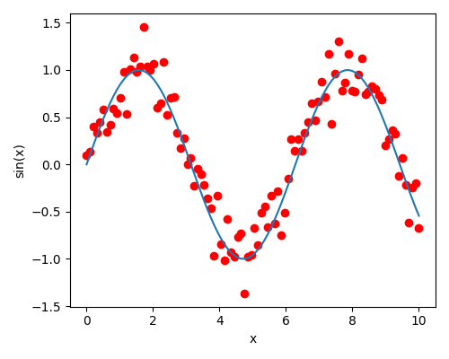
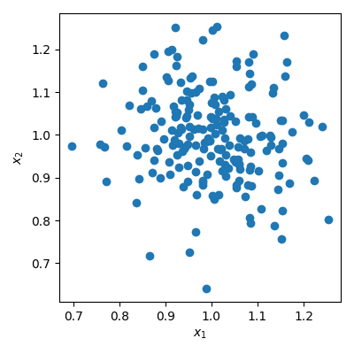
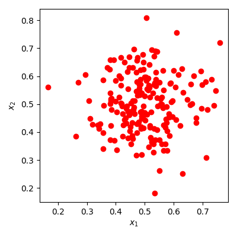
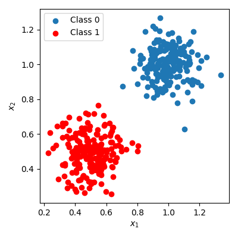
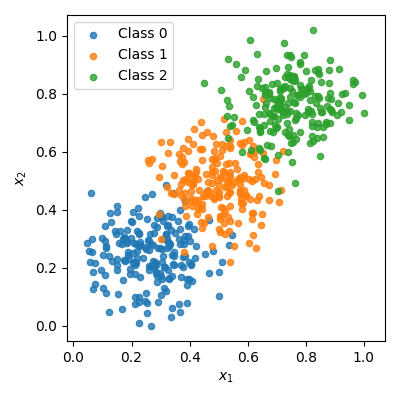
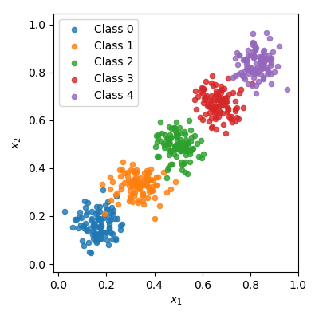
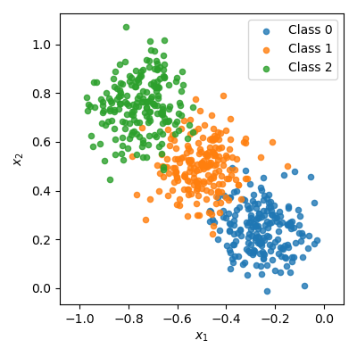
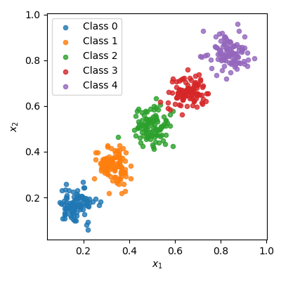
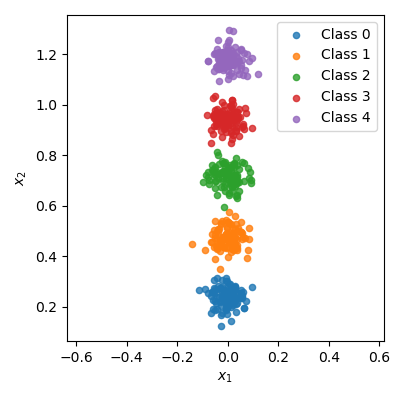
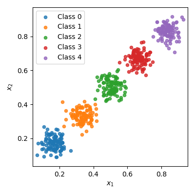

# Lab 00
{:.no_toc}

## Table of contents
{: .no_toc .text-delta }

1. TOC
{:toc}

---

# Introduction to Python

Please note that this is not intended to be a comprehensive introduction to Python, which is outside the scope of this course. Rather, it provides a brief introduction for familiarizing yourself with the functionality needed for the labs. We will be using some of the resources from the official Python/NumPy/Matlplotlib tutorials, as well as some additional information from the documentation of, e.g., NumPy. If you want to dive a bit deeper, you can read all the different topics of the tutorials.

* [Python](https://docs.python.org/3/tutorial/index.html)  
* [NumPy](https://numpy.org/devdocs/user/absolute_beginners.html)
* [Matplotlib](https://matplotlib.org/stable/tutorials/pyplot.html)

## 1. Python basics

### 1.1. Working with lists
Perform the following tasks, and print the results to follow the examples below.
Information about the syntax/functionalities needed for the tasks can be found in the Python tutorial: [Python introduction](https://docs.python.org/3/tutorial/introduction.html)

Define a list with three elements: one string, one number, and one boolean:  
`['some text', 4, True]`

Print the first 4 characters of the string:  
`some`

Extend the list by replecating it three times:  
`['some text', 4, True, 'some text', 4, True, 'some text', 4, True]`

Define a second list with two elements:  
`['str', 2]`

Concatenate both lists:  
`['some text', 4, True, 'some text', 4, True, 'some text', 4, True, 'str', 2]`

Retrieve the last 3 elements of the list (use negative indexing):  
`[True, 'str', 2]`

Append the first list to your final list (making a nested list):  
`[True, 'str', 2, ['some text', 4, True]]`

Print the length of the final list:  
`4`


```python
list1 = ['some text', 4, True]
print(list1)
print(list1[0][0:4])

list2 = list1 + list1 + list1
print(list2)

list3 = ['str', 2]
print(list3)
list3 = list2 + list3
print(list3)

list4 = list3[-3:]
print(list4)

list4.append(list1)
print(list4)

print(len(list4))
```

### 1.2. Control statements
Information on control statements in the Python tutorial: [Python control flow](https://docs.python.org/3/tutorial/controlflow.html)

Define a list with integer numbers from 1 to 15 with increments of 2 (use the `range(...)` function). Write a for-loop to print each element of the list:  
`1`  
`3`  
`5`  
`7`  
`9`  
`11`  
`13`  
`15`

Write a function `square(...)` that accepts one input and returns the square of this (you can use the operator `**`). Define an empty list, and use a for-loop and your function to store the square of each element in the original list above (you use the function `square(...)` for each element and append it to the new list):  
`[1, 9, 25, 49, 81, 121, 169, 225]`

Write a function `is_prime(...)` that accepts one input and returns `True` if it is a prime number, otherwise `False`. You will need to use, e.g., a for-loop, if-statements, and the remainder of division operator (`%`). You should also break the for-loop if the number is determined to be a prime number, to avoid unnecessary calculations. Write a for-loop that outputs each prime number in your original list:  
`3`  
`5`  
`7`  
`11`  
`13`


```python
numbers = list(range(1, 16, 2))
for number in numbers:
    print(number)

print("\nSquared List:")    
def square(x):
    return x**2

square_list=[]
for number in numbers:
    square_list.append(square(number))

print(square_list)


print("\nPrime Numbers:")
def is_prime(x):
    condition=0
    if x==1:
        condition+=1
    
    else:
        for i in range(2,round(x/2)+1):
            if x%i==0:
                condition+=1
                break
    
    if condition>0:
        return False
    else:
        return True

for number in numbers:
    prime = is_prime(number)
    if prime:
        print(number)


```

## 2. NumPy and Matplotlib

### 2.1. NumPy
Read about the basic concepts of NumPy here: [NumPy introduction](https://numpy.org/doc/stable/user/absolute_beginners.html)

Define a list with some numbers:  
`[1, 2, 3, 4, 5, 6, 7, 8]`

Convert the list to a vector (NumPy array):  
`[1 2 3 4 5 6 7 8]`

Print the shape of the vector:  
`(8,)`

[Transpose](https://numpy.org/doc/stable/user/absolute_beginners.html#transposing-and-reshaping-a-matrix) the vector and print the shape:  
`(8,)`

[Convert](https://numpy.org/doc/stable/user/absolute_beginners.html#how-to-convert-a-1d-array-into-a-2d-array-how-to-add-a-new-axis-to-an-array) the vector to a 8x1 dimensional matrix and print the shape:  
`(8, 1)`

Transpose the matrix and print the shape:  
`(1, 8)`

$$
\begin{bmatrix}
1 \\
2 \\
3 \\
4 \\
5 \\
6 \\
7 \\
8 \\
\end{bmatrix}^\intercal=\begin{bmatrix}
1 & 2 & 3 & 4 & 5 & 6 & 7 & 8\\
\end{bmatrix}
$$

Reshape this 1x8 matrix to a 2x4 matrix and print your output:

$$
M = \begin{bmatrix}
1 & 2 & 3 & 4\\
5 & 6 & 7 & 8
\end{bmatrix}
$$

Transposing the matrix $$M$$, you will get a matrix $$N$$:

$$
N = M^\intercal = \begin{bmatrix}
1 & 5 \\
2 & 6 \\
3 & 7 \\
4 & 8 \\
\end{bmatrix}
$$

Perform the [matrix multiplication](https://numpy.org/devdocs/reference/generated/numpy.matmul.html) between the two arrays, $$M$$ and $$N$$:

$$
MN = \begin{bmatrix}
1 & 2 & 3 & 4\\
5 & 6 & 7 & 8
\end{bmatrix}
\begin{bmatrix}
1 & 5 \\
2 & 6 \\
3 & 7 \\
4 & 8 \\
\end{bmatrix} = \begin{bmatrix}
30 & 70 \\
70 & 174 \\
\end{bmatrix}
$$

Reshape the 2x4 matrix $$M$$ to a 2x2x2 [Tensor](https://towardsdatascience.com/what-is-a-tensor-in-deep-learning-6dedd95d6507) and print your output.
How does this 3 dimensional Tensor look like? Copy your output [here](https://array-3d-viz.vercel.app/) to visualize it. How about Tensors with 4 or more dimensions?

Generate a NumPy array with 500 random numbers, using a normal distribution with mean = 1 and standard deviation = 0.5. You can use the NumPy [random normal generator](https://numpy.org/doc/stable/reference/random/generated/numpy.random.Generator.normal.html). Print the shape of the array:  
`(500,)`

Print a formatted output (for formatted printing, see: [Python formatting](https://docs.python.org/3/tutorial/inputoutput.html#fancier-output-formatting)) with the min, max, mean, and [standard deviation](https://numpy.org/doc/stable/reference/routines.statistics.html#averages-and-variances) of your array:  
`min = -0.69, max = 2.67, mean = 1.01, std = 0.53`


```python
import numpy as np

np.random.seed(42)

list1= [1, 2, 3, 4, 5, 6, 7, 8]
print(f"List1:{list1}\n Type:{type(list1)}\n")

array1 = np.array(list1)
print(f"Array1:{array1}\n Type:{type(array1)}\n")

print(f"Shape of Vector:{array1.shape}\n")

array2= array1.T
print(f"Shape of Transposed Vector:{array2.shape}\n")

array1 = array1[:,np.newaxis]
print(f"Shape of Matrix:{array1.shape}\n")

array2=array1.T
print(f"Shape of Transposed Matrix:{array2.shape}\n")

M=array2.reshape(2,4)
print(f"M={M}\n")

N=M.T
print(f"N={N}\n")

print(f"Matrix Multiplication: {np.matmul(M,N)}\n")

M=M.reshape(2,2,2)
print(f"M={M}\n Shape:{M.shape} \n")

new_array = np.random.normal(loc=1.0, scale=0.5, size=(500,))
print(f"Shape of Array with 500 elements:{new_array.shape}\n")

print(f"min={np.min(new_array):.2f}, max={np.max(new_array):.2f}, mean={np.mean(new_array):.2f}, std={np.std(new_array):.2f}")
```

### 2.2. Matplotlib
Read about the basic concepts of Matplotlib here: [Pyplot tutorial](https://matplotlib.org/stable/tutorials/pyplot.html)

Use NumPy to generate a sinusoidal between x=0 and x=10, with 100 uniform sampling locations (you can use the NumPy `linspace` and `sin` functions).

Define a second array by adding some normally distributed noise to your sinusoidal (mean = 0, std = 0.2).

Plot the sinusoidal as a line and the noisy sinusoidal as individual points. Your result should look something like this:  



```python
import matplotlib.pyplot as plt

np.random.seed(42)

x = np.linspace(0,10,100)
y = np.sin(x)

z = np.random.normal(loc=0, scale=0.2, size=(100))

plt.plot(x, y, color="blue")
plt.scatter(x, y + z, color="red")

# Labeling the plot
plt.xlabel("x")
plt.ylabel("sin(x)")
plt.show()
```

### 2.3. Generating a dataset

Create an array with 200 2D points, i.e. a $$200 x 2$$ array, normally distributed with mean=1 and std=0.1. Print the shape of the array:  
`(200, 2)`

Plot the 2D points, i.e. plotting the first dimension against the second:  


Create a second array in the same way, but using mean=0.5:  



Concatenate both arrays into a dataset array `x`. Create another 1D array, `y`, with labels describing which cluster/class the points belong to, 0 for the first and 1 for the second. You will now have a data array with shape `(400, 2)` and a label array with shape `(400,)`.  
Plot the points and use the labels to apply separate colors and legends (for example, you can index the points of the first class as `x[y==0,:]` and plot each class separately by doing the same for the different classes):  



```python
x = np.random.normal(loc=1.0, scale=0.1, size=(200, 2))

plt.figure(figsize=(8, 6))
plt.scatter(x[:,0], x[:,1], color="blue")

plt.xlabel("x1")
plt.ylabel("x2")
plt.show()

y = np.random.normal(loc=0.5, scale=0.1, size=(200, 2))

plt.figure(figsize=(8, 6))
plt.scatter(y[:,0], y[:,1], color="red")

plt.xlabel("x1")
plt.ylabel("x2")
plt.show()

x = np.concatenate((x,y),axis=0)
y1 = np.zeros((200,))
y2 = np.ones((200,))
y = np.concatenate((y1,y2))

plt.figure(figsize=(8, 6))
plt.scatter(x[y == 0, 0], x[y == 0, 1], color='blue', label='Class 0')
plt.scatter(x[y == 1, 0], x[y == 1, 1], color='red', label='Class1')

plt.xlabel('x1')
plt.ylabel('x2')
plt.legend()
plt.show()
```

### 2.4. Data generation and plotting functions

Generalize the dataset generation into a function `generate(K, N, sigma)` that creates a 2D point dataset with of  K different clusters with N points each. The points in each cluster should be normally distributed with std=sigma. Define different mean for the clusters, for example sampled uniformly between 0 to 1 (or you can come up with some other scheme for defining K different mean values).

Write another function for plotting, `plot_data(x, y)`, which plots the dataset x using the labels y, similar to in the previous exercise. You can also pass the number of classes, K, to facilitate the plotting of different classes, i.e. using the function definition `plot_data(x, y, K)`. However, you can also calculate K directly from the label array y (see, e.g., the [NumPy function `unique`](https://numpy.org/devdocs/reference/generated/numpy.unique.html), or since you know that the labels are between 0 to K-1, you can use $$K = \max(y)+1$$).

Using the two different functions you can generate and plot datasets with different configurations:  
 


```python
# K - number of classes/clusters
# N - number of data points in each class
# sigma - std of clusters

def generate(K, N, sigma):
    x =[]
    y =[]
    means = np.linspace(0, 1, K)
    for i in range(0,K):
        mean = means[i]
        x1 = np.random.normal(loc=mean, scale=sigma, size=(N, 2))
        y1 = np.full((N,), i)
        x.append(x1)
        y.append(y1)
    
    x = np.array(x).reshape(N*K,2)
    y = np.array(y).reshape(N*K,)
    return x, y

# x - data points
# y - labels

def plot_data(x, y):
    K = np.unique(y)
    plt.figure(figsize=(8, 6))
    for i in K:
        plt.scatter(x[y == i, 0], x[y == i, 1], label=f'Class {i}')

    plt.xlabel('x1')
    plt.ylabel('x2')
    plt.legend()
    plt.show()

x, y = generate(3, 200, 0.1)
plot_data(x, y)

x, y = generate(5, 100, 0.05)
plot_data(x, y)
```

### 2.5. Data transformation

Define a $$2x2$$ transformation matrix, W:  
`W = np.array([[0,-1],[1, 0]])`

Define an output array with the same size as your data array x. Loop through your data array and transform each 2D point using the transformation matrix, $$\hat{x} = Wx$$. Store the result in the new array.  

**Important note (this will be relevant in Lab 1)**: When you extract a point from your dataset, `xi = x[i,:]`, it will be a 1D array, i.e. `xi.shape: (2,)`. Depending on your NumPy version, the behavior of matrix multiplication with a 1D array is different. For more recent NumPy versions (1.16 and later), the `matmul` and `dot` functions automatically take care of this (*If the second argument is 1-D, it is promoted to a matrix by appending a 1 to its dimensions. After matrix multiplication the appended 1 is removed.* See the notes in the [documentation](https://numpy.org/doc/stable/reference/generated/numpy.matmul.html)). For previous versions, you need to manually extend the dimensionality, so that `xi.shape: (2,1)`, and you can multiply the $$2x2$$ matrix with the $$2x1$$ point. After transformation you need to remove the added dimension, e.g., by indexing `x[:,0]`.

Plot the transformed array:  


Define a function, `rotate(x, ang)`, for rotating the dataset. In the function, you define a $$2x2$$ rotation matrix that rotates your data points by `ang` radians, and you return the rotated dataset. You can use the provided code below to rotate and plot the dataset. This will clear the output (`clear_output()`) for each plot, so that we get an animation of different rotations.


```python
from IPython.display import clear_output

# Dataset
x, y = generate(3, 200, 0.1)

# Transformation matrix
W = np.array([[0,-1],[1, 0]])

# Array for storing transformed dataset
xt = np.empty_like(x)

# Transform each point in the dataset
for i in range(x.shape[0]):
    xt[i] = np.matmul(W, x[i]) 

plot_data(xt,y)
```


```python
def rotate(x, ang):
    xt = np.empty_like(x)
    W = np.array([[np.cos(ang), -np.sin(ang)],
                     [np.sin(ang), np.cos(ang)]])
    for i in range(x.shape[0]):
        xt[i] = np.matmul(W, x[i])
    return xt
    
for ang in np.linspace(0, 2*np.pi, 30):
    xt = rotate(x, ang)
    clear_output(wait=True)
    plot_data(xt,y)

```

## 3. All comes together

### 3.1. The dataset generator

For information about classes, see the Python tutorial: [Python classes](https://docs.python.org/3/tutorial/classes.html)

Open a new python file (not a notebook) and name it "*data_generator.py*". In this file, create a class called **DataGenerator**. In the constructor (`__init__(self)`) you can define the data **x** and labels **y** as empty lists:  
`self.x = []`  
`self.y = []`

Add the `generate` and `plot_data` functions from above to your class. Make sure to modify the functions to use the class instance variables (`self.x` and `self.y`). The function `generate` creates a new dataset and stores this using the class instance variables, while `plot_data` plots these (thus, we don't need to pass x and y to this function). You should be able to run the code below and get a result similar to:  



```python
import numpy as np
import data_generator

# importlib is used to reload the data_generator. Otherwise we need to restart 
# the kernel of the notebook each time we make changes to data_generator.py
import importlib
importlib.reload(data_generator)

# Create an instance of the DataGenerator class
dg = data_generator.DataGenerator()

# Generate some data and plot
dg.generate(5, 100, 0.04)
dg.plot_data()
```

### 3.2. Additional functionalities

Add also the `rotate` function to the data generator class. This should modify the class instance variable (`self.x`) instead of returning the transformed data.

Create functions `export_data` and `import_data` that can be used to save the dataset to disc and load an existing dataset, respectively. **x** and **y** can be separately stored as ".npy" files using `np.save`. You can also store them in the same ".npz" file using `np.savez`. See the [Python documentation](https://numpy.org/devdocs/reference/routines.io.html) for information about reading and writing NumPy arrays.

If you want to make it more challenging, you can try to export and import the labels **y** as a plain text file. For more information on reading and writing text files, you can start by reading about this in the [Python tutorial](https://docs.python.org/3/tutorial/inputoutput.html#reading-and-writing-files).

With your added functions, you should be able to run the below code and get something like this as output:  




```python
import numpy as np

import importlib
import data_generator
importlib.reload(data_generator)

dg = data_generator.DataGenerator()
dg.generate(5, 100, 0.04)
dg.export_data('output.npz')

# Rotate the dataset
dg.rotate(0.25*np.pi)
dg.plot_data()

# Create a new data generator and load the data
# exported from the previous generator
dg2 = data_generator.DataGenerator()
dg2.import_data('output.npz')
dg2.plot_data()
```

```python
# data_generator.py

import numpy as np
import matplotlib.pyplot as plt
import random

class DataGenerator:
    def __init__(self, ):
        self.x = []
        self.y = []

    def generate(self,K, N, sigma):
        means = np.linspace(0, 1, K)
        for i in range(0,K):
            mean = means[i]
            x1 = np.random.normal(loc=mean, scale=sigma, size=(N, 2))
            y1 = np.full((N,), i)
            self.x.append(x1)
            self.y.append(y1)
        
        self.x = np.array(self.x).reshape(N*K,2)
        self.y = np.array(self.y).reshape(N*K,)
        return self.x, self.y

    def plot_data(self,):
        K = np.unique(self.y)
        plt.figure(figsize=(8, 6))
        for i in K:
            plt.scatter(self.x[self.y == i, 0], self.x[self.y == i, 1], label=f'Class {i}')

        plt.xlabel('x1')
        plt.ylabel('x2')
        plt.legend()
        plt.show()
    
    def rotate(self, ang):
        W = np.array([[np.cos(ang), -np.sin(ang)],
                        [np.sin(ang), np.cos(ang)]])
        for i in range(self.x.shape[0]):
            self.x[i] = np.matmul(W, self.x[i])
        
        return self.x
    
    def export_data(self,name):
        np.savez(name,x=self.x, y=self.y)
        print(f"{name} is saved!")
    
    def import_data(self,name):
        load_data = np.load(name)
        self.x = load_data["x"]
        self.y = load_data["y"]
        print(f"{name} is loaded!")

```
