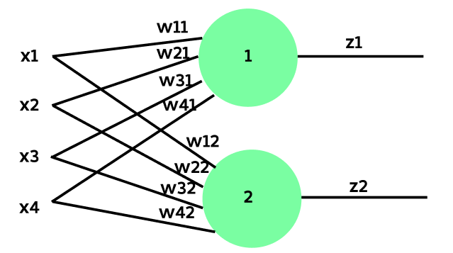
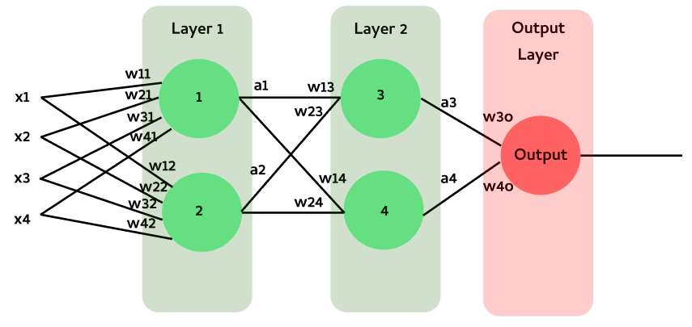

# Teaching Session 1
{:.no_toc}

---
In this teaching session, we will build on our learning from the `lab00`(`Introduction to Python`) and create a simple neural network from scratch and see how different components of neural network training works using numpy.


### Task 1: Define a Single Neuron

In this task,  we’ll create a single neuron that takes 4 input features [x1, x2, x3, x4] and produces a single output value.


```math
                                    Z = X W^\intercal + B =\begin{bmatrix} x1 & x2 & x3 & x4 \end{bmatrix} \begin{bmatrix} w1 & w2 & w3 & w4 \end{bmatrix}^\intercal + [b1],
```

```math
                                    output = relu(Z)
```                             


```python
np.random.seed(4)

# Step1: Define a function for neuron that accepts x and return z = Wxᵀ+b
def neurons(x,W,B):
    # Perform the operation Wᵀx + B
    return np.matmul(x,np.transpose(W)) + B

# Step2: Define a function that accepts an array and applies relu activation
def activation(x):
    return np.maximum(0, x)

# Step3: Initialise Weights and biases
W = np.random.randn(1,4)
B = np.random.randn(1)
```


```python
# Testing the neuron with sample input
input_vector = np.random.normal(loc=0, scale=1, size=(1,4))  # Random input vector
Z = neurons(input_vector, W, B)
output = activation(Z)

# Print the input and output
print("Input:", input_vector)
print("Weights:", W)
print("Bias Term:", B)
print("Z:", Z)
print("Output:", output)
```

    Input: [[-1.14747663  0.61866969 -0.08798693  0.4250724 ]]
    Weights: [[ 0.05056171  0.49995133 -0.99590893  0.69359851]]
    Bias Term: [-0.41830152]
    Z: [[0.21544139]]
    Output: [[0.21544139]]


### Task 2: Add another Neuron
Now, let's add one more neuron to this layer. Rather than performing the calculations separately, we’ll concatenate the weights of the second neuron into the same weight matrix W as shown below:

$$
                                    Z = X W^\intercal + B = \begin{bmatrix} x1 & x2 & x3 & x4 \end{bmatrix} \begin{bmatrix} w11 & w21 & w31 & w41 \\ w12 & w22 & w32 & w42\end{bmatrix}^\intercal + \begin{bmatrix}b1 & b2\end{bmatrix},
$$ 

$$ 
                                    output = relu(z)
$$




**Note:**
In my setup, W  has dimensions [N x M] and X  has dimensions [L x M], where:

- N is the number of neurons,
- M is the number of input features for the layer,
- L is the dataset length or number of inputs.

Given these shapes, the calculation of z will be $ X W^\intercal + B $. Some textbooks, however, may represent this calculation as $W X + B$. Ultimately, it’s still a matrix multiplication, so just ensure the matrix dimensions are aligned accordingly.


```python
# Step1: Initialise Weights W = [[w11, w21, w31, w41],[w12, w22, w32, w42]] and bias B = [b1, b2]
np.random.seed(4)
W = np.random.randn(2,4)
B = np.random.randn(1,2)
```


```python
# Testing the neurons with sample input
input_vector = np.random.normal(loc=0, scale=1, size=(1,4))
Z = neurons(input_vector, W, B)
output = activation(Z)

# Print the input and output
print("Input:", input_vector)
print("Weights:", W)
print("Bias Term:", B)
print("Z:", Z)
print("Output:", output)
```

    Input: [[ 0.61866969 -0.08798693  0.4250724   0.33225315]]
    Weights: [[ 0.05056171  0.49995133 -0.99590893  0.69359851]
     [-0.41830152 -1.58457724 -0.64770677  0.59857517]]
    Bias Term: [[ 0.33225003 -1.14747663]]
    Z: [[ 0.12665874 -1.3432888 ]]
    Output: [[0.12665874 0.        ]]


### Task 3: Build a Neural Network

Previously, we explored how to create a layer with multiple neurons. Now, let’s build a simple neural network as illustrated in the figure below:



Write your implementation on the computations performed at each layer, as defined by the equations below:
#### Layer 1:
$$
                                    Z₁ = X W₁^\intercal + B₁ = \begin{bmatrix} x1 & x2 & x3 & x4 \end{bmatrix} \begin{bmatrix} w11 & w21 & w31 & w41 \\ w12 & w22 & w32 & w42\end{bmatrix}^\intercal + \begin{bmatrix}b1 & b2\end{bmatrix},
$$ 

$$ 
                                    A₁ = \begin{bmatrix}a1 & a2\end{bmatrix} = relu(Z₁)
$$

#### Layer 2:
$$
                                    Z₂ = A₁ W₂^\intercal + B₂ = \begin{bmatrix} a1 & a2 \end{bmatrix} \begin{bmatrix} w13 & w23 \\ w14 & w24\end{bmatrix}^\intercal + \begin{bmatrix}b3 & b4\end{bmatrix},
$$ 

$$ 
                                    A₂ = \begin{bmatrix}a3 & a4\end{bmatrix} = relu(Z₂)
$$

#### Layer 3:
$$
                                    Z₃ = A₂ W₃^\intercal + B₃ = \begin{bmatrix} a3 & a4 \end{bmatrix} \begin{bmatrix} w3o & w4o \end{bmatrix}^\intercal + \begin{bmatrix}bo\end{bmatrix},
$$ 

$$ 
                                    Output = sigmoid(Z₃)
$$


```python
np.random.seed(4)

class SimpleNeuralNetwork:
    def __init__(self,):
        # Initialize weights and biases for Layer 1 (input to first hidden layer)
        self.W1 = np.random.randn(2,4)
        self.B1 = np.random.randn(1,2)
        
        # Initialize weights and biases for Layer 2 (first hidden to second hidden layer)
        self.W2 = np.random.randn(2, 2)
        self.B2 = np.random.randn(1,2)
        
        # Initialize weights and biases for Output Layer (second hidden to output layer)
        self.W3 = np.random.randn(1, 2)
        self.B3 = np.random.randn(1,)
    
    def relu(self, z):
        return np.maximum(0, z)
    
    def sigmoid(self, z):
        return 1 / (1 + np.exp(-z))
    
    def forward(self, X):
        # Layer 1 forward pass
        Z1 = np.matmul(X,np.transpose(self.W1)) + self.B1
        A1 = self.relu(Z1)

        # Layer 2 forward pass
        Z2 = np.matmul(A1,np.transpose(self.W2)) + self.B2
        A2 = self.relu(Z2)
        
        # Output layer forward pass
        Z3 = np.matmul(A2,np.transpose(self.W3)) + self.B3
        Z3 = Z3.flatten()
        output = self.sigmoid(Z3)
        
        return output

# Instantiate the neural network
network = SimpleNeuralNetwork()
```


```python
# Testing the neural network with sample input
X = np.random.normal(loc=0, scale=1, size=(1,4))

# Perform a forward pass
output = network.forward(X)
print("Output:", output)
```

    Output: [0.8173195]


### Task 4 Dataset Creation

Let’s create a dataset suitable for training the neural network described above. We'll generate the dataset similarly to what was done in lab00. Follow the steps outlined below:

   1. x1 = [128 x 4] input arrays sampled from normal distribution with mean=1 and std=0.1. These input values belong to Class '0' i.e. y1 is a zero array of length = 128.

   2. x2 = [128 x 4] input arrays sampled from normal distribution with mean=0.5 and std=0.1. These input values belong to Class '1' i.e. y2 is an array of 1s with length = 128.

   3. Concatenate x1 and x2 into X (which is the input data) and y1 and y2 into Y (which is the output data). Perform a data shuffle through indices


```python
class MyDataset:
    def __init__(self):
        # Generate data samples
        self.data, self.labels = self._generate_data()

    def _generate_data(self):
        # Generate samples for Class 0
        x1 = np.random.normal(loc=1.0, scale=0.1, size=(128, 4))
        y1 = np.zeros((128, 1), dtype=int)

        # Generate samples for Class 1
        x2 = np.random.normal(loc=0.5, scale=0.1, size=(128, 4))
        y2 = np.ones((128, 1), dtype=int)

        # Concatenate data and labels
        data = np.vstack((x1, x2))
        labels = np.vstack((y1, y2)).flatten()  

        return data, labels

    def __getitem__(self, idx):
        return self.data[idx], self.labels[idx]

    def __len__(self):
        return len(self.labels)


class DataLoader:
    def __init__(self, dataset, batch_size=32, shuffle=True):
        self.dataset = dataset
        self.batch_size = batch_size
        self.shuffle = shuffle
        self.indices = np.arange(len(self.dataset))
        if self.shuffle:
            np.random.shuffle(self.indices)

    def __iter__(self):
        for start_idx in range(0, len(self.dataset), self.batch_size):
            batch_indices = self.indices[start_idx:start_idx + self.batch_size]
            batch_data = [self.dataset[i] for i in batch_indices]
            data, labels = zip(*batch_data)
            yield np.array(data), np.array(labels)

    def __len__(self):
        return int(np.ceil(len(self.dataset) / self.batch_size))

dataset = MyDataset()
dataloader = DataLoader(dataset, batch_size=32, shuffle=True)

print(f'Number of Input Data: {len(dataset)}\nNumber of Batches: {len(dataloader)}')
```

    Number of Input Data: 256
    Number of Batches: 8


### Task 5: Batch Computation

From task 1 to task 3, we have worked with the neural network using a single input array. Now, let's see if it can handle a batch of input arrays, specifically 32 input arrays in this instance. 


```python
# Initialize the Dataset and use the first batch
dataset = MyDataset()
dataloader = DataLoader(dataset, batch_size=32, shuffle=True)
first_batch_data, first_batch_labels = next(iter(dataloader))

print("Shape of first batch data:\n", first_batch_data.shape)
print("Shape of first batch labels:\n", first_batch_labels.shape)

# Instantiate the neural network
network = SimpleNeuralNetwork()
output = network.forward(first_batch_data)
print("Output:", output.shape)
```

    Shape of first batch data:
     (32, 4)
    Shape of first batch labels:
     (32,)
    Output: (32,)


### Task 6: Gradient Calculation and Training


```python
np.random.seed(4)

# Initialize the Dataset
dataset = MyDataset()
dataloader = DataLoader(dataset, batch_size=32, shuffle=True)

# Do batch computation over the dataset
print(f"Epoch 1:")
print("===============================================")
for batch_idx, (data, labels) in enumerate(dataloader):
    
    print(f"Batch {batch_idx + 1}:")
    
        
```

    Epoch 1:
    ===============================================
    Batch 1:
    Batch 2:
    Batch 3:
    Batch 4:
    Batch 5:
    Batch 6:
    Batch 7:
    Batch 8:


